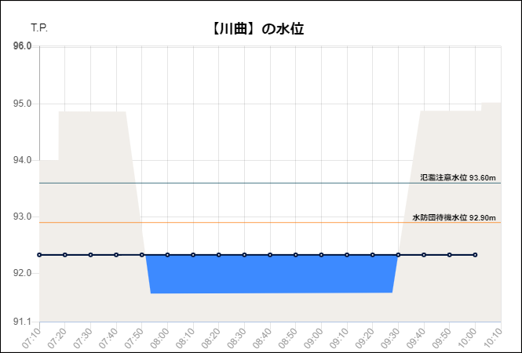

# CTIE-CHART

観測所グラフ [CTIE-CHART Web App](https://github.com/CTIE-TOKYO-MIZU/CTIE-TOKYO-MIZU.github.io).



## Features/highlights

- a sample e-commerce shopping site
- pattern for a real-life shopping cart and store checkout flow
- pattern for using custom announcers for accessibility

## Setup
```bash
$ git clone https://github.com/Polymer/shop.git
$ cd shop
$ npm i
$ npm start
```

## Build
```bash
$ npm run build
```

## Test the build
To test prpl-server build:
```bash
$ npm run serve:prpl-server
```
To test static build:
```bash
$ npm run serve:static
```

## Deploying

Our [production deployment of SHOP](https://shop.polymer-project.org/) is hosted on App Engine with Node.js. It can be deployed with [the same steps as PWA Starter Kit](https://polymer.github.io/pwa-starter-kit/building-and-deploying/#deploying-prpl-server).
